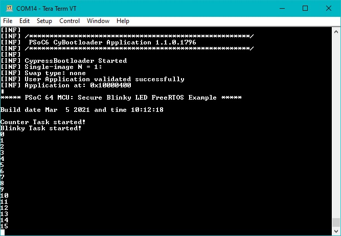

# PSoC&trade; 64: Secure blinky LED FreeRTOS

This code example demonstrates the implementation of two simple FreeRTOS tasks:

1. Toggle an LED periodically using PSoC&trade; 64.
2. Increment a value once a second and print the value through the debug UART.

## Requirements

- [ModusToolbox&trade;](https://www.infineon.com/modustoolbox) v3.0 or later (tested with v3.2)
- [CySecureTools](https://pypi.org/project/cysecuretools/): 4.1.0
- Other tools: Python v3.8.10 or later
- Programming language: C
- Associated parts: All [PSoC&trade; 64](https://www.infineon.com/cms/en/product/microcontroller/32-bit-psoc-arm-cortex-microcontroller/psoc-6-32-bit-arm-cortex-m4-mcu/psoc-64/) parts

## Supported toolchains (make variable 'TOOLCHAIN')

- GNU Arm&reg; Embedded Compiler v10.3.1 (`GCC_ARM`) – Default value of `TOOLCHAIN`
- Arm&reg; Compiler v6.16 (`ARM`)
- IAR C/C++ Compiler v9.30.1 (`IAR`)

## Supported kits (make variable 'TARGET')

- [PSoC&trade; 64 "Secure Boot" Wi-Fi Bluetooth&reg; Pioneer Kit](https://www.infineon.com/CY8CKIT-064B0S2-4343W) (`CY8CKIT-064B0S2-4343W`)
- [PSoC&trade; 64 "Secure Boot" Prototyping Kit](https://www.infineon.com/CY8CPROTO-064S1-SB) (`CY8CPROTO-064S1-SB`)
- [PSoC&trade; 64 "Secure Boot" Prototyping Kit](https://www.infineon.com/CY8CPROTO-064B0S3) (`CY8CPROTO-064B0S3`)

> **Note:** See the ["Secure Boot" SDK user guide](https://www.infineon.com/dgdlac/Infineon-PSoC_64_Secure_MCU_Secure_Boot_SDK_User_Guide-Software-v07_00-EN.pdf?fileId=8ac78c8c7d0d8da4017d0f8c361a7666) before you start working with a target enabled with "Secure Boot".

## Hardware setup

This example is used with PSoC&trade; 64 "Secure" MCU kits. To program and run the example on a PSoC&trade; 64 "Secure" MCU platform, the device must be provisioned with keys and policies, and then programmed with the signed firmware to boot up correctly.

## Software setup

See the [ModusToolbox&trade; tools package installation guide](https://www.infineon.com/ModusToolboxInstallguide) for information about installing and configuring the tools package.

1. Install a terminal emulator if you don't have one. Instructions in this document use [Tera Term](https://teratermproject.github.io/index-en.html).
2. Install the Python interpreter and add it to the top of the system path in environmental variables. This code example is tested with [Python v3.8.10](https://www.python.org/downloads/release/python-3810/).
3. Install the CySecureTools package.

### Install Python

#### On Windows:

1. Download and install the latest Python release from [Python Releases for Windows](https://www.python.org/downloads/windows/).
2. Pip now comes bundled with new versions of Python. Make sure that pip is using Python v3.8.10 or later.

   ```
   > pip --version
   ```


#### On Linux:

Most distributions of Linux usually have Python2 and Python3 installed.

1. Verify that Python points to Python3 Run the following command:

   ```
   > python --version
   ```

2. If Python is not installed on your machine, install it using the following command:

   ```
   > sudo apt install python3
   ```

3. To install pip, run the following command:

   ```
   > sudo apt install python3-pip
   ```

4. Make sure that pip is using Python v3.8.10:

   ```
   > pip --version
   ```

#### On macOS:

1. Download and install the latest Python v3.0 release from [Python Releases for macOS](https://www.python.org/downloads/mac-osx/).

2. Install pip:

   ```
   > python3 -m pip install --upgrade pip
   ```

### Install CySecureTools

1. Run the following command:

   ```
   > pip install cysecuretools
   ```

## Using the code example

### Create the project

The ModusToolbox&trade; tools package provides the Project Creator as both a GUI tool and a command line tool.

<details><summary><b>Use Project Creator GUI</b></summary>

1. Open the Project Creator GUI tool.

   There are several ways to do this, including launching it from the dashboard or from inside the Eclipse IDE. For more details, see the [Project Creator user guide](https://www.infineon.com/ModusToolboxProjectCreator) (locally available at *{ModusToolbox&trade; install directory}/tools_{version}/project-creator/docs/project-creator.pdf*).

2. On the **Choose Board Support Package (BSP)** page, select a kit supported by this code example. See [Supported kits](#supported-kits-make-variable-target).

   > **Note:** To use this code example for a kit not listed here, you may need to update the source files. If the kit does not have the required resources, the application may not work.

3. On the **Select Application** page:

   a. Select the **Applications(s) Root Path** and the **Target IDE**.

   > **Note:** Depending on how you open the Project Creator tool, these fields may be pre-selected for you.

   b.	Select this code example from the list by enabling its check box.

   > **Note:** You can narrow the list of displayed examples by typing in the filter box.

   c. (Optional) Change the suggested **New Application Name** and **New BSP Name**.

   d. Click **Create** to complete the application creation process.

</details>

<details><summary><b>Use Project Creator CLI</b></summary>

The 'project-creator-cli' tool can be used to create applications from a CLI terminal or from within batch files or shell scripts. This tool is available in the *{ModusToolbox&trade; install directory}/tools_{version}/project-creator/* directory.

Use a CLI terminal to invoke the 'project-creator-cli' tool. On Windows, use the command-line 'modus-shell' program provided in the ModusToolbox&trade; installation instead of a standard Windows command-line application. This shell provides access to all ModusToolbox&trade; tools. You can access it by typing "modus-shell" in the search box in the Windows menu. In Linux and macOS, you can use any terminal application.

The following example clones the "[mtb-example-psoc6-secure-blinkyled-freertos](https://github.com/Infineon/mtb-example-psoc6-secure-blinkyled-freertos)" application with the desired name "MySecureBlinkyledFreertos" configured for the *CY8CPROTO-064S1-SB* BSP into the specified working directory, *C:/mtb_projects*:

   ```
   project-creator-cli --board-id CY8CPROTO-064S1-SB --app-id mtb-example-psoc6-secure-blinkyled-freertos --user-app-name MySecureBlinkyledFreertos --target-dir "C:/mtb_projects"
   ```


The 'project-creator-cli' tool has the following arguments:

Argument | Description | Required/optional
---------|-------------|-----------
`--board-id` | Defined in the <id> field of the [BSP](https://github.com/Infineon?q=bsp-manifest&type=&language=&sort=) manifest | Required
`--app-id`   | Defined in the <id> field of the [CE](https://github.com/Infineon?q=ce-manifest&type=&language=&sort=) manifest | Required
`--target-dir`| Specify the directory in which the application is to be created if you prefer not to use the default current working directory | Optional
`--user-app-name`| Specify the name of the application if you prefer to have a name other than the example's default name | Optional

> **Note:** The project-creator-cli tool uses the `git clone` and `make getlibs` commands to fetch the repository and import the required libraries. For details, see the "Project creator tools" section of the [ModusToolbox&trade; tools package user guide](https://www.infineon.com/ModusToolboxUserGuide) (locally available at {ModusToolbox&trade; install directory}/docs_{version}/mtb_user_guide.pdf).

</details>

### Open the project

After the project has been created, you can open it in your preferred development environment.


<details><summary><b>Eclipse IDE</b></summary>

If you opened the Project Creator tool from the included Eclipse IDE, the project will open in Eclipse automatically.

For more details, see the [Eclipse IDE for ModusToolbox&trade; user guide](https://www.infineon.com/MTBEclipseIDEUserGuide) (locally available at *{ModusToolbox&trade; install directory}/docs_{version}/mt_ide_user_guide.pdf*).

For **macOS** and **Linux**, add *python3* to PATH environment variable in the Eclipse project configuration:
   1. Go to **Project** > **Properties** > **C/C++Build** > **Environment**.

   2. Add your path to Python3 executable to the actual PATH. <br>
   For example, *(...:/Library/Frameworks/Python.framework/Versions/3.8/bin)*.
</details>


<details><summary><b>Visual Studio (VS) Code</b></summary>

Launch VS Code manually, and then open the generated *{project-name}.code-workspace* file located in the project directory.

For more details, see the [Visual Studio Code for ModusToolbox&trade; user guide](https://www.infineon.com/MTBVSCodeUserGuide) (locally available at *{ModusToolbox&trade; install directory}/docs_{version}/mt_vscode_user_guide.pdf*).

</details>


<details><summary><b>Keil µVision</b></summary>

Double-click the generated *{project-name}.cprj* file to launch the Keil µVision IDE.

For more details, see the [Keil µVision for ModusToolbox&trade; user guide](https://www.infineon.com/MTBuVisionUserGuide) (locally available at *{ModusToolbox&trade; install directory}/docs_{version}/mt_uvision_user_guide.pdf*).

</details>


<details><summary><b>IAR Embedded Workbench</b></summary>

Open IAR Embedded Workbench manually, and create a new project. Then select the generated *{project-name}.ipcf* file located in the project directory.

For more details, see the [IAR Embedded Workbench for ModusToolbox&trade; user guide](https://www.infineon.com/MTBIARUserGuide) (locally available at *{ModusToolbox&trade; install directory}/docs_{version}/mt_iar_user_guide.pdf*).

</details>


<details><summary><b>Command line</b></summary>

If you prefer to use the CLI, open the appropriate terminal, and navigate to the project directory. On Windows, use the command-line 'modus-shell' program; on Linux and macOS, you can use any terminal application. From there, you can run various `make` commands.

For more details, see the [ModusToolbox&trade; tools package user guide](https://www.infineon.com/ModusToolboxUserGuide) (locally available at *{ModusToolbox&trade; install directory}/docs_{version}/mtb_user_guide.pdf*).

</details>

### Policy and keys

1. Add the policy that was used to provision the device into the project.

   1. Ensure that you are in the *%WORKSPACE%/Secure_Blinky_LED_FreeRTOS/* directory.

   2. Execute the following command to finalize project initialization:

      ```
      > cysecuretools -t <kit-name> init
      ```

      For example, the following command finalizes project initialization for the **CY8CKIT-064B0S2-4343W** kit:

      ```
      > cysecuretools -t cy8ckit-064b0s2-4343w init
      ```

   	  > **Note:**  After executing the `init` command, all files required for the application signing will be copied into the *%WORKSPACE%/Secure_Blinky_LED_FreeRTOS/* directory, including the default policy for the chosen `<kit-name>`.

2. Add the keys that were used to provision the device into the project.

   Ensure that you are in the *%WORKSPACE%/Secure_Blinky_LED_FreeRTOS/* directory and the policy is already added in your project.

   If you do not have the keys, generate default keys using the following command:

   ```
   > cysecuretools -t <kit-name> -p <policy> create-keys
   ```

   For example, the following command generates the default keys for the **CY8CKIT-064B0S2-4343W** kit:

   ```
   > cysecuretools -t cy8ckit-064b0s2-4343w -p policy/policy_single_CM0_CM4_swap.json create-keys
   ```

   > **Note:** If you generate the keys, you must use these keys to provision your device. Otherwise, the example will not work correctly. See the "Generate New Keys" section in the ["Secure Boot" SDK User Guide](https://www.infineon.com/dgdlac/Infineon-PSoC_64_Secure_MCU_Secure_Boot_SDK_User_Guide-Software-v07_00-EN.pdf?fileId=8ac78c8c7d0d8da4017d0f8c361a7666).

3. Provision the device. In this step, the CySecureTools application provisions the device based on the policy file.  It performs the following three steps:

   1. Reads the provided policy and forms the final provisioning packet, named *prov_cmt.jwt*

   2. Performs the entrance exam to verify that the device has not been altered

   3. Provisions the device by sending the *prov_cmd.jwt* packet to the PSoC&trade; 64 "Secure" MCU

   Before running this step, you may modify the default policy to match your end use case. For most development use cases, you do not need to modify it. See the SDK user guide for more information.

   > **Note:** KitProg3 or MiniProg4 must be in DAPLink mode. The kit supply voltage must be 2.5 V to perform this step. See the relevant kit user guide to learn how to change the supply voltage for your kit.

   ```
   > cysecuretools -t <kit-name> -p <policy> provision-device
   ```

   For example, the following command generates the default keys for the **CY8CKIT-064B0S2-4343W** kit:

   ```
   > cysecuretools -t cy8ckit-064b0s2-4343w -p policy/policy_single_CM0_CM4_swap.json provision-device
   ```

## Operation

If using a PSoC&trade; 64 "Secure" MCU kit (like CY8CKIT-064B0S2-4343W), the PSoC&trade; 64 device must be provisioned with keys and policies before being programmed. Follow the instructions in the ["Secure Boot" SDK user guide](https://www.infineon.com/dgdlac/Infineon-PSoC_64_Secure_MCU_Secure_Boot_SDK_User_Guide-Software-v07_00-EN.pdf?fileId=8ac78c8c7d0d8da4017d0f8c361a7666) to provision the device. If the kit is already provisioned, copy-paste the keys and policy folder to the application folder.
1. Connect the board to your PC using the provided USB cable through the KitProg3 USB connector.

2. Open a terminal program and select the KitProg3 COM port. Set the serial port parameters to 8N1 and 115200 baud.

3. Program the board using one of the following:

   <details><summary><b>Using Eclipse IDE</b></summary>

      1. Select the application project in the Project Explorer.

      2. In the **Quick Panel**, scroll down, and click **\<Application Name> Program (KitProg3_MiniProg4)**.
   </details>


   <details><summary><b>In other IDEs</b></summary>

   Follow the instructions in your preferred IDE.
   </details>


   <details><summary><b>Using CLI</b></summary>

     From the terminal, execute the `make program` command to build and program the application using the default toolchain to the default target. The default toolchain is specified in the application's Makefile but you can override this value manually:
      ```
      make program TOOLCHAIN=<toolchain>
      ```

      Example:
      ```
      make program TOOLCHAIN=GCC_ARM
      ```
   </details>

4. After programming, the application starts automatically. Observe that the kit's LED blinks at 1 Hz.

5. Connect a terminal emulator to display the debug output at startup, and continuous count output. Make the terminal settings as 115200 baud, 8N1, and no flow control.

   **Figure 1: Terminal output on program startup**

   


> **Note:**  During the boot up phase of PSoC&trade; 64, you may see garbled data on the terminal emulator screen. It is because the KitProg3's (PSoC&trade; 5LP) debug UART RX input is not driven by PSoC&trade; 64 for a period of time. By default, the Cypress Bootloader in PSoC&trade; 64 is in the debug mode and will print out bootloader status information. After this information is printed, the PSoC&trade; 64 TX GPIO is returned to its default Hi-Z state. By the time the PSoC&trade; 64 TX GPIO pin is returned to Hi-Z and the PSoC&trade; 64 application code reconfigures the GPIO pin, this signal may float and appear as UART data to the KitProg3 UART, which may be displayed as random characters on a terminal emulator. To eliminate this garbled data, a 10-K pull-down resistor may be added between the PSoC&trade; 64 P5.1 GPIO and GND. This pulls the signal to GND while the PSoC&trade; 64 GPIO is Hi-Z and eliminates random noise-inducing invalid 1s and 0s to be detected by the KitProg3 UART.


## Debugging

You can debug the example to step through the code.


<details><summary><b>In Eclipse IDE</b></summary>

Use the **\<Application Name> Debug (KitProg3_MiniProg4)** configuration in the **Quick Panel**. For details, see the "Program and debug" section in the [Eclipse IDE for ModusToolbox&trade; user guide](https://www.infineon.com/MTBEclipseIDEUserGuide).


> **Note:** **(Only while debugging)** On the CM4 CPU, some code in `main()` may execute before the debugger halts at the beginning of `main()`. This means that some code executes twice – once before the debugger stops execution, and again after the debugger resets the program counter to the beginning of `main()`. See [KBA231071](https://community.infineon.com/docs/DOC-21143) to learn about this and for the workaround.

</details>


<details><summary><b>In other IDEs</b></summary>

Follow the instructions in your preferred IDE.
</details>


## Design and implementation

This example is designed to evaluate a simple FreeRTOS-based application on PSoC&trade; 64 devices using single-stage bootloading. The BSP Makefile's post-build command signs the application hex image built with ModusToolbox&trade;, so that the signed image can be programmed and run on PSoC&trade; 64 kits.

This example's source code is in the *main.c* file. The application's entry point is the `main()` function. It creates two FreeRTOS threads: "Blinky task" and "Counter task". The `main()` function also initializes a FreeRTOS scheduler by invoking `vTaskStartScheduler()`.
The `blinky_task` blinks an LED at a 1-Hz rate.  The `counter_task` increments a counter and displays the value at a 1-Hz rate via a UART.

## Related resources


Resources  | Links
-----------|----------------------------------
Application notes  | [AN228571](https://www.infineon.com/AN228571) – Getting started with PSoC&trade; 6 MCU on ModusToolbox&trade; <br>  [AN215656](https://www.infineon.com/AN215656) – PSoC&trade; 6 MCU: Dual-CPU system design <br>   [AN85951](https://www.infineon.com/AN85951) – PSoC&trade; 4 and PSoC&trade; 6 MCU CAPSENSE&trade; design guide
Code examples  | [Using ModusToolbox&trade;](https://github.com/Infineon/Code-Examples-for-ModusToolbox-Software) on GitHub
Device documentation | [PSoC&trade; 6 MCU datasheets](https://documentation.infineon.com/html/psoc6/bnm1651211483724.html) <br> [PSoC&trade; 6 technical reference manuals](https://documentation.infineon.com/html/psoc6/zrs1651212645947.html)
Development kits | Select your kits from the [Evaluation board finder](https://www.infineon.com/cms/en/design-support/finder-selection-tools/product-finder/evaluation-board).
Libraries on GitHub  | [mtb-pdl-cat1](https://github.com/Infineon/mtb-pdl-cat1) – PSoC&trade; 6 Peripheral Driver Library (PDL)  <br> [mtb-hal-cat1](https://github.com/Infineon/mtb-hal-cat1) – Hardware Abstraction Layer (HAL) library <br> [retarget-io](https://github.com/Infineon/retarget-io) – Utility library to retarget STDIO messages to a UART port <br>  [mtb-hal-cat2](https://github.com/Infineon/mtb-hal-cat2) – Hardware Abstraction Layer (HAL) library
Middleware on GitHub  | [capsense](https://github.com/Infineon/capsense) – CAPSENSE&trade; library and documents <br> [psoc6-middleware](https://github.com/Infineon/modustoolbox-software#psoc-6-middleware-libraries) – Links to all PSoC&trade; 6 MCU middleware
Tools  | [ModusToolbox&trade;](https://www.infineon.com/modustoolbox) – ModusToolbox&trade; software is a collection of easy-to-use libraries and tools enabling rapid development with Infineon MCUs for applications ranging from wireless and cloud-connected systems, edge AI/ML, embedded sense and control, to wired USB connectivity using PSoC&trade; Industrial/IoT MCUs, AIROC&trade; Wi-Fi and Bluetooth&reg; connectivity devices, XMC&trade; Industrial MCUs, and EZ-USB&trade;/EZ-PD&trade; wired connectivity controllers. ModusToolbox&trade; incorporates a comprehensive set of BSPs, HAL, libraries, configuration tools, and provides support for industry-standard IDEs to fast-track your embedded application development.

<br>


## Other resources

Infineon provides a wealth of data at [www.infineon.com](https://www.infineon.com) to help you select the right device, and quickly and effectively integrate it into your design.

For PSoC&trade; 6 MCU devices, see [How to design with PSoC&trade; 6 MCU - KBA223067](https://community.infineon.com/docs/DOC-14644) in the Infineon developer community.


## Document history

Document title: *CE228684* – *PSoC&trade; 64 MCU: "Secure blinky LED with FreeRTOS"*

 Version | Description of change
 ------- | ---------------------
 1.0.0   | New code example
 2.0.0   | Major update to support ModusToolbox&trade; v2.2, added support for new kits <br> This version is not backward compatible with ModusToolbox&trade; v2.1
 3.0.0   | Major update to support ModusToolbox&trade; v3.0.<br> This version is not backward compatible with previous versions of ModusToolbox&trade;.
 3.1.0   | Updated to support ModusToolbox&trade; v3.2
<br>

All referenced product or service names and trademarks are the property of their respective owners.

The Bluetooth&reg; word mark and logos are registered trademarks owned by Bluetooth SIG, Inc., and any use of such marks by Infineon is under license.

---------------------------------------------------------

© Cypress Semiconductor Corporation, 2019-2024. This document is the property of Cypress Semiconductor Corporation, an Infineon Technologies company, and its affiliates ("Cypress").  This document, including any software or firmware included or referenced in this document ("Software"), is owned by Cypress under the intellectual property laws and treaties of the United States and other countries worldwide.  Cypress reserves all rights under such laws and treaties and does not, except as specifically stated in this paragraph, grant any license under its patents, copyrights, trademarks, or other intellectual property rights.  If the Software is not accompanied by a license agreement and you do not otherwise have a written agreement with Cypress governing the use of the Software, then Cypress hereby grants you a personal, non-exclusive, nontransferable license (without the right to sublicense) (1) under its copyright rights in the Software (a) for Software provided in source code form, to modify and reproduce the Software solely for use with Cypress hardware products, only internally within your organization, and (b) to distribute the Software in binary code form externally to end users (either directly or indirectly through resellers and distributors), solely for use on Cypress hardware product units, and (2) under those claims of Cypress's patents that are infringed by the Software (as provided by Cypress, unmodified) to make, use, distribute, and import the Software solely for use with Cypress hardware products.  Any other use, reproduction, modification, translation, or compilation of the Software is prohibited.
<br>
TO THE EXTENT PERMITTED BY APPLICABLE LAW, CYPRESS MAKES NO WARRANTY OF ANY KIND, EXPRESS OR IMPLIED, WITH REGARD TO THIS DOCUMENT OR ANY SOFTWARE OR ACCOMPANYING HARDWARE, INCLUDING, BUT NOT LIMITED TO, THE IMPLIED WARRANTIES OF MERCHANTABILITY AND FITNESS FOR A PARTICULAR PURPOSE.  No computing device can be absolutely secure.  Therefore, despite security measures implemented in Cypress hardware or software products, Cypress shall have no liability arising out of any security breach, such as unauthorized access to or use of a Cypress product. CYPRESS DOES NOT REPRESENT, WARRANT, OR GUARANTEE THAT CYPRESS PRODUCTS, OR SYSTEMS CREATED USING CYPRESS PRODUCTS, WILL BE FREE FROM CORRUPTION, ATTACK, VIRUSES, INTERFERENCE, HACKING, DATA LOSS OR THEFT, OR OTHER SECURITY INTRUSION (collectively, "Security Breach").  Cypress disclaims any liability relating to any Security Breach, and you shall and hereby do release Cypress from any claim, damage, or other liability arising from any Security Breach.  In addition, the products described in these materials may contain design defects or errors known as errata which may cause the product to deviate from published specifications. To the extent permitted by applicable law, Cypress reserves the right to make changes to this document without further notice. Cypress does not assume any liability arising out of the application or use of any product or circuit described in this document. Any information provided in this document, including any sample design information or programming code, is provided only for reference purposes.  It is the responsibility of the user of this document to properly design, program, and test the functionality and safety of any application made of this information and any resulting product.  "High-Risk Device" means any device or system whose failure could cause personal injury, death, or property damage.  Examples of High-Risk Devices are weapons, nuclear installations, surgical implants, and other medical devices.  "Critical Component" means any component of a High-Risk Device whose failure to perform can be reasonably expected to cause, directly or indirectly, the failure of the High-Risk Device, or to affect its safety or effectiveness.  Cypress is not liable, in whole or in part, and you shall and hereby do release Cypress from any claim, damage, or other liability arising from any use of a Cypress product as a Critical Component in a High-Risk Device. You shall indemnify and hold Cypress, including its affiliates, and its directors, officers, employees, agents, distributors, and assigns harmless from and against all claims, costs, damages, and expenses, arising out of any claim, including claims for product liability, personal injury or death, or property damage arising from any use of a Cypress product as a Critical Component in a High-Risk Device. Cypress products are not intended or authorized for use as a Critical Component in any High-Risk Device except to the limited extent that (i) Cypress's published data sheet for the product explicitly states Cypress has qualified the product for use in a specific High-Risk Device, or (ii) Cypress has given you advance written authorization to use the product as a Critical Component in the specific High-Risk Device and you have signed a separate indemnification agreement.
<br>
Cypress, the Cypress logo, and combinations thereof, ModusToolbox, PSoC, CAPSENSE, EZ-USB, F-RAM, and TRAVEO are trademarks or registered trademarks of Cypress or a subsidiary of Cypress in the United States or in other countries. For a more complete list of Cypress trademarks, visit [www.infineon.com](https://www.infineon.com). Other names and brands may be claimed as property of their respective owners.
